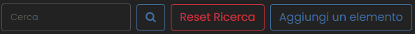
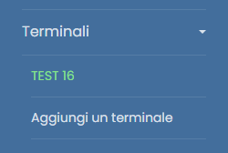

# DoorEdit
L'accesso all'applicazione può essere effettuato inserendo l'indirizzo *192.168.1.61:81* nella barra degli indirizzi di un qualsiasi browser o cliccando sul seguente collegamento: [Accesso all'applicazione](http://192.168.1.61:81).

## 🔑 Login
Si prega di procedere con l'autenticazione utilizzando le proprie credenziali di accesso. L'username coincide con quello del dominio. 
> Nel caso del primo accesso, utilizzare *Password1* come password (si suggerisce inoltre di modificare la password dopo il primo accesso per motivi di sicurezza).

 

## 📖 Pagine

### 🏠 Home
All'interno della schermata principale, è presente una **barra laterale** appositamente dedicata alla navigazione all'interno del sito. La **sidebar** è richiudibile per offrire anche una navigazione a *schermo intero*.

#### 📋 Sidebar
Le opzioni sono le seguenti:
- Effettuare il logout
- Cambiare la password
- [Accesso alla pagina dell'anagrafica](#👤-anagrafica)
- [Menù a tendina con tutti i terminali](#🚪-terminali)
- [Pagina sotrico transiti](#🚶‍♂️transiti)

 

### 👤 Anagrafica
La pagina offre un elenco completo dell'anagrafica, riportando tutti i **nominativi** insieme ai rispettivi **codici badge**. Inoltre, è possibile verificare lo stato di **abilitazione** all'accesso per ciascuna persona.

Si presentano ulteriori funzionalità come:
- 🔍 La possibiltà di ricercare una persona per **nome**, **cognome** opppure **codice**
- ➕ Aggiungere un elemento all'elenco

-  🗑️ Eliminare un elemento 
- ✏️ Modificare un elemento
  - All'interno della pagina di modifica, si offre la capacità di effettuare sia un'azione globale per l'abilitazione o la disabilitazione di una persona, che azioni specifiche per la gestione dell'accesso a ciascun terminale.

 

### 🚪 Terminali
All'interno della barra laterale, una volta che hai espanso il menu a tendina, si potrà accedere a diverse opzioni relative alla gestione dei terminali.

- ➕ **Aggiungi Nuovo Terminale**: Questa opzione consentirà di inserire un nuovo terminale nel sistema. Può essere utilizzata per registrare nuovi dispositivi o punti di accesso.
  

- 🛠️ **Pagina di Gestione Terminale**: Questa opizione offre la possibilità di *eliminazione*, *modifica* o di ***gestione degli accessi*** di quel terminale.
  - La gestione degli accessi è una pagina distinta, per maggiori informazioni cliccare [qui](#🔧-gestione-degli-accessi)

Queste opzioni mirano a offrire un controllo accurato sulla gestione dei terminali, consentendo l'aggiunta, modifica o eliminazione delle informazioni relative a ciascun terminale in modo efficace e conforme alle esigenze.

 

### 🚶‍♂️Transiti
La sezione dedicata ai *transiti* presenta una struttura essenziale costituita da una tabella. Questa tabella espone in modo chiaro e conciso ogni singolo tentativo di accesso, fornendo dettagli fondamentali come l'**orario**, il **numero del badge**, il **nome**, il **cognome** e l'identificazione del **terminale coinvolto**.

È opportuno notare che gli accessi rifiutati sono distinti attraverso l'utilizzo di una rappresentazione cromatica. In particolare, gli accessi negati sono evidenziati utilizzando uil colore rosso, offrendo così una visualizzazione immediata e chiara di questa particolare condizione.

 

### 🔧 Gestione degli Accessi
La pagina è strutturata intorno a una semplice tabella, in cui ciascuna riga rappresenta un'autorizzazione univoca. Questo approccio permette una visualizzazione chiara e organizzata delle diverse autorizzazioni presenti.

Per apportare modifiche alle autorizzazioni, è possibile **revocare** o **aggiungere** nuove autorizzazioni tramite l'utilizzo di un pulsante collocato alla base della tabella.